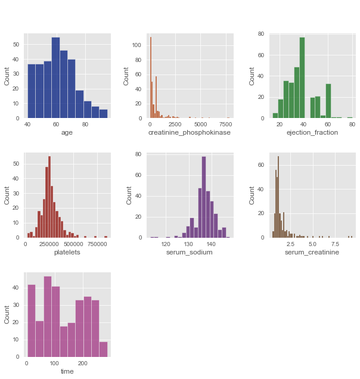
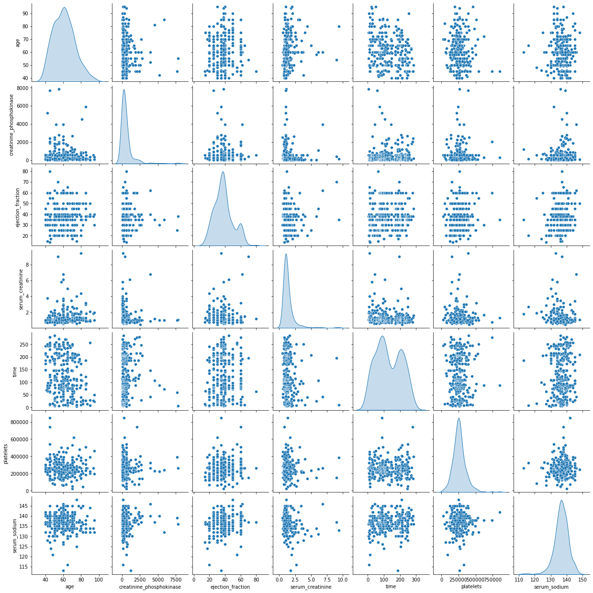
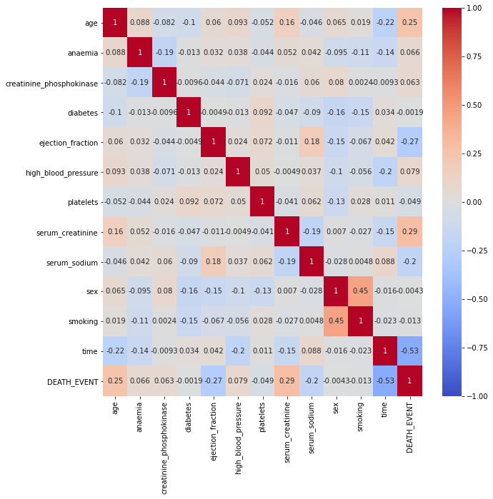

# Survival-Prediction-based-on-CVD

This repository contains exploratory data analysis (EDA), insightful visualizations, and describes the machine learning algorithms (Logistic Regression, Random Forest, Decision Tree, SVM) used for predicting mortality in patients due to cardiovascular failure.

## Table of Contents
- [Introduction](#introduction)
- [Dataset](#dataset)
- [Visualizations](#visualizations)
- [Feature Selection](#feature-selection)
- [ML Classification & Hyperparameter Tuning](#ML-classification-&-hyperparameter-tuning)
- [Evaluation Metrics](#evaluation-metrics)

## Introduction
The project describes machine learning techniques for predicting mortality due to cardiovascular failure in an individual based on medical measurements. EDA and visualizations are performed on the data to gain insights about the most significant factors contributing to mortality.

## Dataset
The dataset used for this project is named "heart_failure_clinical_records_dataset.csv" and includes 13 variables related to clinical and physical measurements, as well as information derived from the individual's daily lifestyle.

## Visualizations
EDA and visualizations are carried out to understand the data distribution and correlations between features.

## Feature Selection
In the feature selection stage, three methods were applied to the training dataset:
* LinearSVC
* Anova F-values
* Random-Forest Classifier

## ML Classification & Hyperparameter Tuning
Four machine learning algorithms are employed to predict mortality in patients:
* Logistic Regression
* Random Forest
* Decision Tree
* SVM

The best hyperparameters for each algorithm separately are selected based on the grid search method (GridSearchCV) in combination with the 10-fold stratified cross-validation method (Stratified K-Fold CrossValidation) from Scikit-Learn.

## Evaluation Metrics
Accuracy, Presicion, Recall, F1-score, Confusion matrix and Average-Precision scores are used to compare the algorithms performance.
